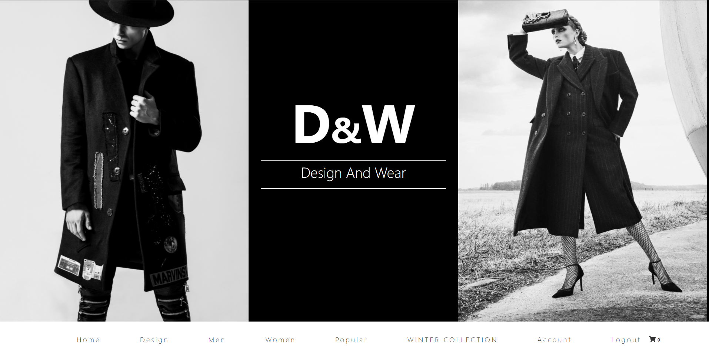
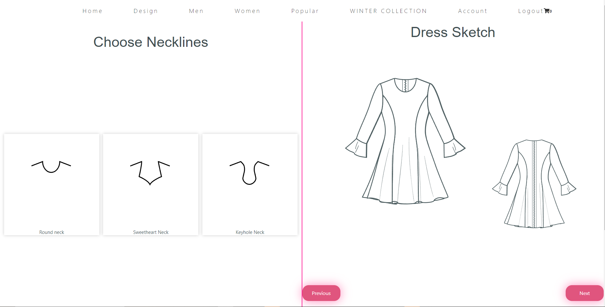
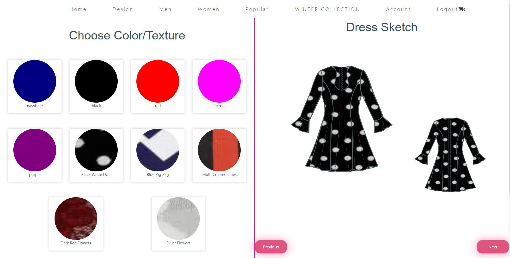
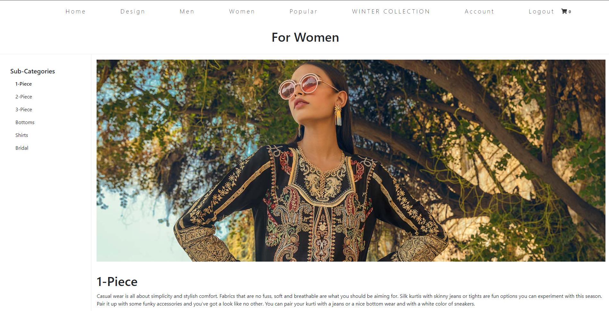
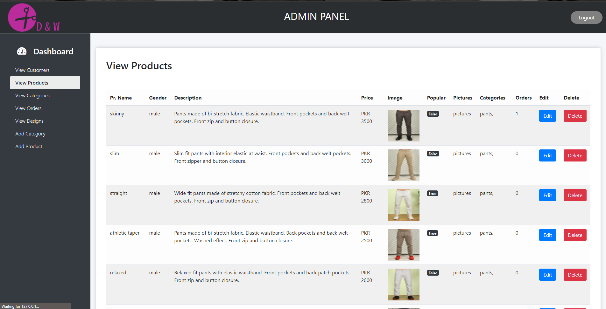

# Design And Wear - DnW

This is a web application which has all the features of a normal e commerce clothing store, with an additional functionality of designing a custom dress to be stitched and delivered to the user.
This web application is built using Python-Flask.


## Screenshots

Main Page -



Custom Design-1 -



Custom Design-2 -



Ready Made Dress -



Admin Panel -


## Installation

Clone and install the requirements from requirements.txt

```bash
  pip install -r requirements.txt 
```

Once the requirements are properly installed, run the application from run.py .

```bash
  python run.py 
```
